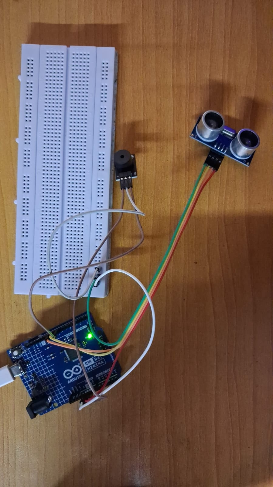

# Ultrasonic Obstacle Detection Arduino

An Arduino Uno R4 Minima project that uses the **HC-SR04 Ultrasonic Sensor** to detect nearby obstacles and an **Active Buzzer** to provide rhythmic alerts when an object is within **10 cm**.

---

## 📸 Project Image



---

## ✨ Features

- Measures distance using the HC-SR04 ultrasonic sensor
- Detects objects within 10 cm
- Generates rhythmic buzzer alerts
- Displays real-time distance on the Serial Monitor
- Beginner-friendly Arduino project

---

## 🛠️ Components Used

- Arduino Uno R4 Minima
- HC-SR04 Ultrasonic Sensor
- 3-Pin Active Buzzer
- Breadboard
- Jumper Wires
- USB Cable

---

## 🔌 Circuit Connections

### HC-SR04 Ultrasonic Sensor

| HC-SR04 Pin | Arduino Pin |
|--------------|-------------|
| VCC | 5V |
| GND | GND |
| Trig | D9 |
| Echo | D10 |

### Active Buzzer

| Buzzer Pin | Arduino Pin |
|------------|-------------|
| S | D8 |
| + | 5V |
| - | GND |

---

## ⚙️ Working Principle

1. The Arduino sends a trigger pulse to the HC-SR04 ultrasonic sensor.
2. The sensor measures the time taken for the echo to return.
3. The distance is calculated using the speed of sound.
4. If the detected distance is **10 cm or less**, the active buzzer produces rhythmic beeps.
5. As the object gets closer, the delay between beeps decreases, creating faster alerts.
6. The measured distance is continuously displayed in the Serial Monitor.

---

## 📂 Repository Structure

```
Ultrasonic-Obstacle-Detection-Arduino/
│
├── Ultrasonic-Obstacle-Detection.ino
├── Ultrasonic-Obstacle-Detection.jpeg
├── README.md
└── LICENSE
```

---

## 🚀 How to Use

1. Connect the components according to the wiring table.
2. Open `Ultrasonic-Obstacle-Detection.ino` in the Arduino IDE.
3. Select **Arduino Uno R4 Minima** from **Tools → Board**.
4. Select the correct COM port.
5. Upload the code.
6. Open the Serial Monitor (9600 baud).
7. Move an object toward the sensor to hear the rhythmic buzzer alerts.

---

## 💻 Sample Output

```
Distance: 34.25 cm
Distance: 18.40 cm
Distance: 9.82 cm
Distance: 5.47 cm
Distance: 2.18 cm
```

---

## 🔮 Future Improvements

- OLED/LCD display for distance
- RGB LED indication
- Servo motor scanning
- Wi-Fi/Bluetooth connectivity
- Adjustable detection threshold using a potentiometer

---

## 📚 Technologies Used

- Arduino IDE
- Arduino C/C++
- Embedded Systems
- Sensor Interfacing

---

## 👨‍💻 Author

**Sushanth J**

Electronics and Communication Engineering Student

---

⭐ If you found this project useful, consider giving it a **Star**!
